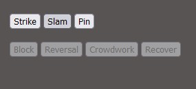

# Pro Wrestling Fighter
*A game by Vogue Boney*
---
Pro Wrestling Fighter is turn based combat game with elements from Rock Paper Scissors,turn-based roleplaying games, and just a *dash* of the game-design ethos of Punchout.

## How to Play
To start the game, simply click the 'Start Game' button at the top of the page. 

The game is played in rounds, with each round consisting of one fighter being on the offensive, and the opposing fighter defending. These positions swap for each fighter after every round. Both the human player and the computer opponent have access to the same attack and defensive moves.

There are two possible win conditions for the game:
- Reduce the opponent to 0 Health
- Successfully pin the opponent

As the player, you will always start the game as the attacker. You'll find your attack palette on the left side of the window. While you are the attacker, your defensive manuever options will be unavailable.

When attacking, you have access to three different moves:
- Strike: Deals a small, fixed amount of base damage. Has a chance of inflicting the Daze status on the opponent
- Slam: Deal a large, fixed amount of base damage. Can be countered by 'Reversal' defensive manuever. Has a chance of knocking the opponent Prone.
- Pin: Costs 3 stamina to use. Attempt to pin the oppenent for a three-count. If successful, the opponent is defeated instantly. Success chance is effected by the opponents current health, as well as Prone status.

Once a move has been selected, both fighters' actions will be displayed and resolved in the combat log near the bottom of the window.

After a round on the offensive has been completed, you'll be placed on the defensive. During the defending phase, your attack maneuvers will be unavailable.

When defending, you have access to four moves:
- Block: Costs 1 stamina. Will reduce the total damage of a Strike attack by half.
- Reversal: Evades and counters the Slam attack, dealing damage back to the attacker.
- Crowdwork: The wrestler attempts to work up the crowd. If successful, the fighter's hype level increases until the end of their next attack round. There is a chance for your theatrics to fall flat, however...

